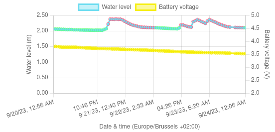

I've created a bunch of IoT projects over the years. Some with [custom PCBs and
machine vision](#water-usage-monitoring), others with [off-the-shelf relay
modules](#smartifying-an-old-space-heater), and most with [custom C++ or Rust
firmware](#water-well-level-sensor). Most of all, they have been a
great way to learn with just the right amount of hackiness.

## Door Handle Opener

Because an in-door smart lock was out of the question in our rented apartment,
and of course for the fun of it, I built this door handle opener. It straps to
the door handle and can easily be removed without leaving a trace (just like the
[space heater I smartified](#smartifying-an-old-space-heater)).

Check out the [GitHub repo](https://github.com/ubipo/door-handle-opener) for a 
detailed write-up.

<video width="320" controls>
  <source src="/content/projects/door-handle-opener-poc-demo.webm" type="video/mp4">
</video>

## Water Well Level Sensor

My dad and I needed a way to ensure the water level in a rain water collection
well doesn't drop too low and that a pump actually uses the water as scheduled.
So, as a fun end-to-end IoT project, I put together a sensor, serverless
backend, and web UI.

Check out the [GitHub repo](https://github.com/ubipo/water-well-level/) with all
source code, terraform scripts, and a detailed write-up.

## Water Usage Monitoring

This project uses a small camera and WiFi microcontroller to read the digits on
an analog water meter. Since I built this in 2018 (?) Belgium has started to 
roll out smart water meters, but at the time we still had an analog one without
even a reed switch port. This project was a great reason to try out a bunch of
then new things for me: PCB design, training a neural net, and using a camera
in an embedded electronics project.

My custom PCB, designed and ordered through [EasyEDA](https://easyeda.com/), was
mounted above the water meter using a piece of wood. It supports an
[ESP8266](https://www.espressif.com/en/products/socs/esp8266) WiFi
microcontroller, and an [ArduCam](https://www.arducam.com/) camera module.
Periodically, the ESP8266 wakes up, lights a small LED, and takes a picture of
the meter display. As the ESP already struggles just to take the picture, the
processing happens off-board on a [Flask](https://flask.palletsprojects.com)
server running on my home server (back then the
[ODROID-H2](https://www.hardkernel.com/shop/odroid-h2/)).

For each upload, the server first does a crude color-based bounds detection of
the two digits groups (black-on-white for whole liters, white-on-red for
fractions) using [OpenCV](https://opencv.org/). Then, these two groups are then
each split into individual digits, using the black separation lines. Finally,
each digit is fed into a [PyTorch](https://pytorch.org/) neural net. It is a
simple convolutional network designed for digit recognition, and trained using
my desktop's GPU on a dataset of just over 140 images I collected and manually
labeled. This tiny dataset was fine because of how consistent the digits are.

## Smartifying an Old Space Heater

This project had some great reverse-engineering fun. I used an off-the-shelf
4-relay ESP module to control an old wall-mounted space heater in my dorm room.
One of the relays was wired in parallel with the heater's original switch, and
was controlled from a [HomeAssistant](https://www.home-assistant.io/) server
running on a Raspberry PI. That server also connected to a [bluetooth air
quality/temperature sensor](https://aranet.com/products/aranet4/), effectively
acting as a smart thermostat. I designed the case for the ESP module in [Fusion
360](https://www.autodesk.com/products/fusion-360/overview) and printed it at a
local maker space.

<video width="320" controls>
  <source src="/content/projects/space-heater-video.mp4" type="video/mp4">
</video> 

## Hacking + Smartifying a Garage Gate

This was an assignment for the *Security* module in the last year of my IT
Bachelor's. I used a [software defined
radio](https://www.realtek.com/en/products/communications-network-ics/item/rtl2832u)
to sniff the communication between a remote control and its garage gate. After
decoding the rolling code in the transmission using [Universal Radio
Hacker](https://github.com/jopohl/urh), I relayed it using a [generic 433MHz
transmitter](https://www.adafruit.com/product/3071).

If miniaturized, this system could be installed near the gate and collect
rolling codes whenever an authorized user opens the garage gate. This way, the
attacker can open the gate at any later time. [The presentation
slides](/content/projects/gate-RF-replay.pdf) contain diagrams to explain the
attack.

<video controls preload="metadata" style="width: 100%;">
  <source src="/content/projects/gate-rf-replay-demo.mp4" type="video/mp4" />
  <track
    label="English"
    kind="subtitles"
    srclang="en"
    src="/content/projects/gate-rf-replay-demo.vtt"
    default />
</video>

Of course I had no personal need for this attack because I already had a remote
for the gate. Being the lazy software developer I am however, it did get me
thinking about how nice it would be to be able to open the gate from my phone.
So I soldered a relay to the remote control and hooked it up to the [Home
Assistant](https://www.home-assistant.io/) server in my dorm room. Infinite
garage opener range achieved ♾️!

## Dimming Lamps and Controlling LED Strips

Besides all of the above, I've also used IoT to dim lamps, control LED strips
and hook into light switches. All those mini projects are some combination of
taking a cheap ESP module, connecting it to a relay or breakout board and
hooking it up to [Home Assistant](https://www.home-assistant.io/). Below for
example is a video of me controlling a [RobotDyn AC
dimmer](https://www.amazon.com/GENUINE-RobotDYN-Programmable-Controller-Compatible/dp/B071X19VL1)
via an ESP32 and hooked up to an Ikea lamp.

When it comes to the firmware on the WiFi modules, I've done everything from:
writing my own HTTP servers in C++ and no-std Rust, implementing a basic MQTT
client, writing a custom UDP protocol, and of course simply flashing
[ESPHome](https://esphome.io/) or [Tasmota](https://tasmota.github.io/docs/).

<video controls style="width: 100%;">
  <source src="/content/projects/iot-dimming.mp4" type="video/mp4" />
</video>
