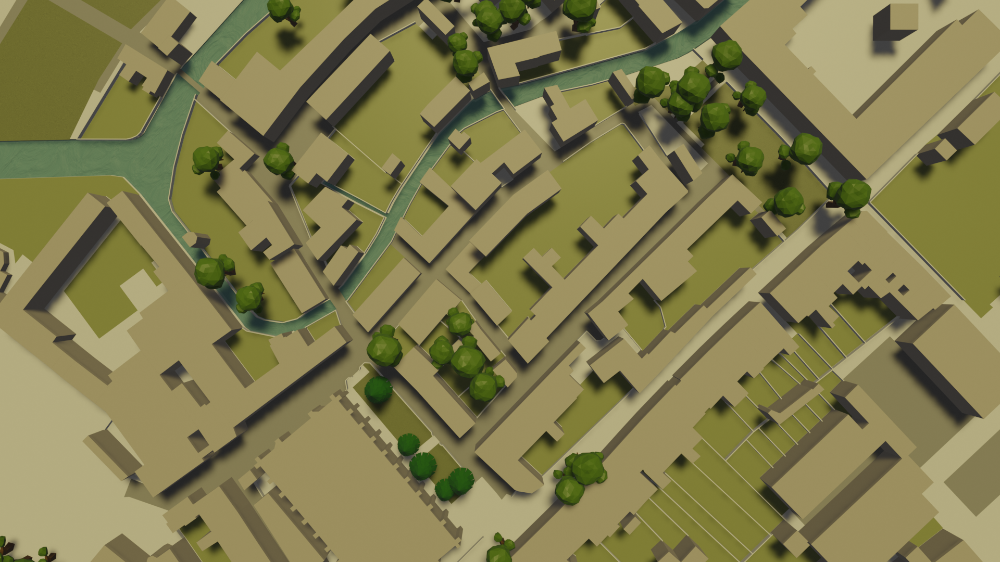

# Pieter Fiers

{dropword}`Hi!`I like maps, machine learning and
microcontrollers. This site is a home to showcase my favorite
[projects](/projects), and the [technologies](/technologies) used to build them.

Read about [Pathy](/projects/pathy), a small rover that autonomously follows
forest paths, check out my [IoT](/projects/iot) projects for [machine
vision](/projects/iot#water-usage-monitoring) 🤖 software or a [self-opening
door](/projects/iot#door-handle-opener), or browse the source code for a
[mouse-tracking depth camera](/projects/kinect-mouse-tracker) 🐁.

Want to get in touch?  
[pieter@pfiers.net](mailto:pieter@pfiers.net) — 
[Resume](/resume.html) — 
[LinkedIn](https://www.linkedin.com/in/pfiers) — 
[GitHub](https://github.com/ubipo)

